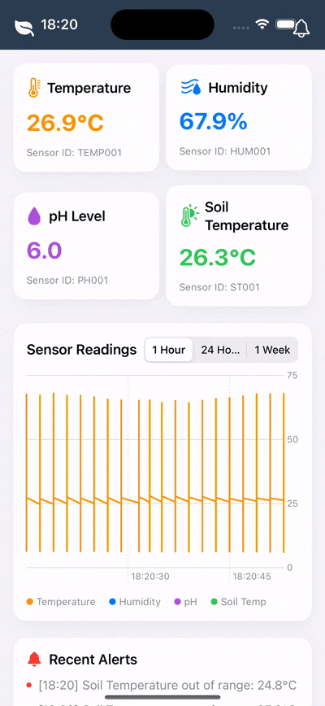
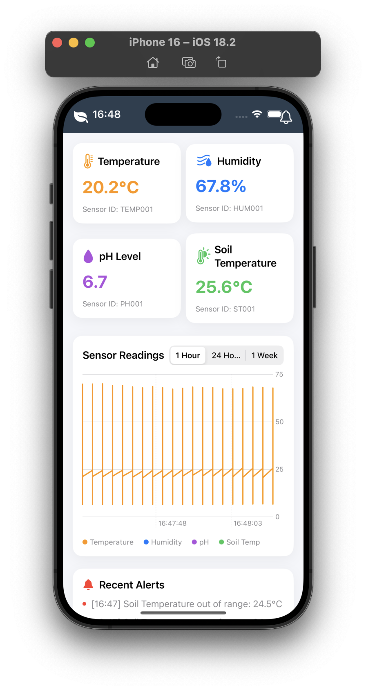
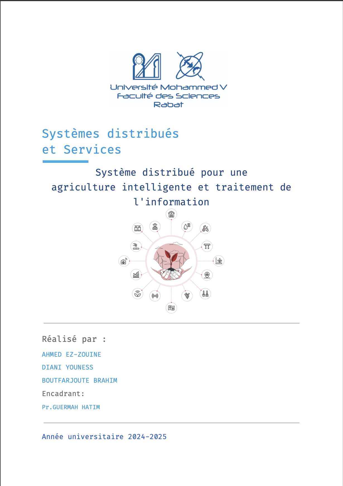

### 🚀 Distributed System for Smart Agriculture and Information Processing


The main objective of this project is to design a distributed system that enables the monitoring and intelligent management of environmental conditions on a farm. This system will provide farmers with an effective tool to collect, analyze, and visualize data from various sensors (temperature, soil moisture, pH) in real time.


<p align="center">
  
  <br>
</p>

---

## 🎥 Demo en Video  

<p align="center">
  
  <br>
  <br>
  <br>
  <br>
  <br>
  
</p>

---

## 📸 Screenshots  
| Home | Alert |
| -------- | -------- |
|  |  |
<p align="center">
  <br>
  
</p>

---

## 📌 Features  
✅ visualiser les donnees pH <br>
✅ visualiser les donnees température <br>
✅ visualiser les donnees température soil <br>
✅ visualiser les donnees humidité

---

## 🛠️ Installation  

1. Clone the repository  
   ```sh
   git clone git@github.com:ahmedez-zouine/smart_agriculture_system.git
