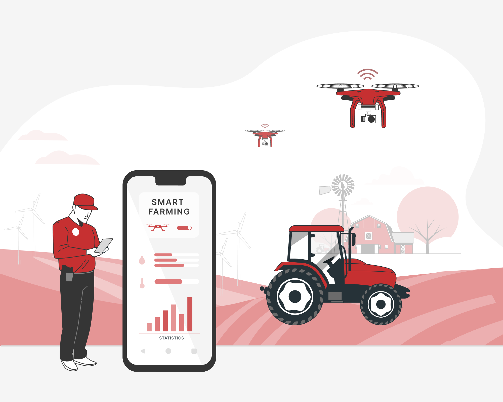
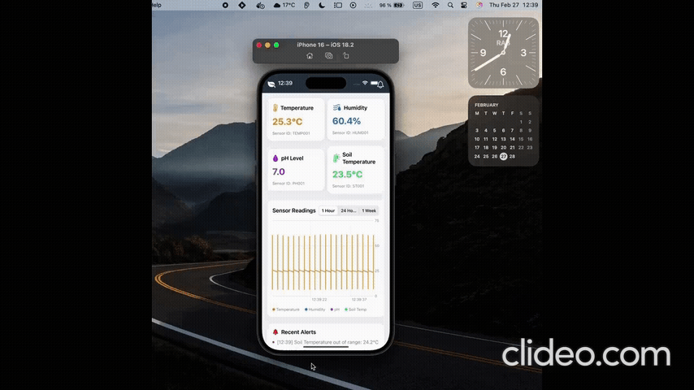
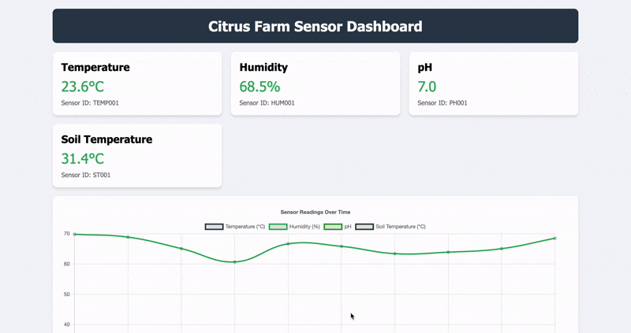
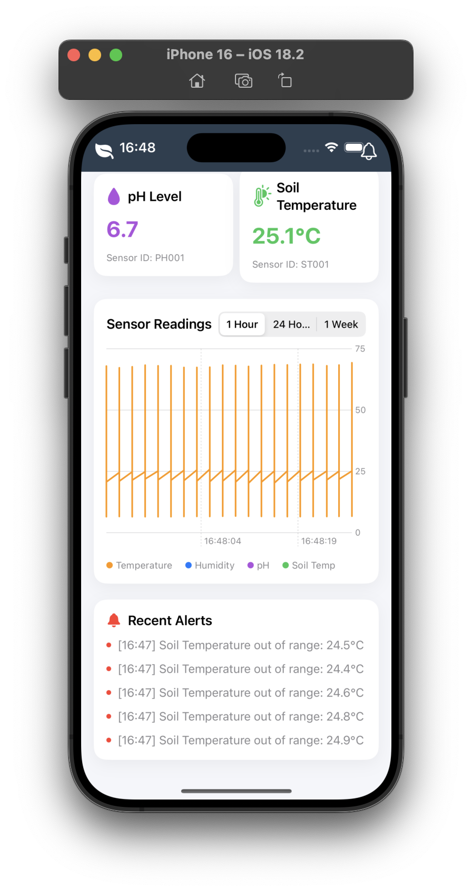

### 🚀 Système distribué pour une‬ agriculture intelligente et traitement de‬ l'information 

L’objectif principal de ce projet est de concevoir un système distribué permettant la surveillance et la gestion intelligente des‬ Conditions environnementales dans une exploitation agricole Ce‬ système offrira aux agriculteurs un outil efficace pour collecter ‭ analyser et visualiser les données provenant de différents capteurs‬ ‭ (température, humidité du sol, pH) en temps réel.‬


<p align="center">
  
  <br>
</p>

---

## 🎥 Démonstration en Vidéo  

<p align="center">
  
  
</p>

---

## 📸 Screenshots  
| Home | Alert |
| -------- | -------- |
|  |  |
<p align="center">
  <br>
  
</p>

---

## 📌 Features  
✅ visualiser les données pH <br>
✅ visualiser les données température <br>
✅ visualiser les données température soil <br>
✅ visualiser les données humidité

---

## 🛠️ Installation  

1. Clone the repository  
   ```sh
   git clone git@github.com:ahmedez-zouine/smart_agriculture_system.git
